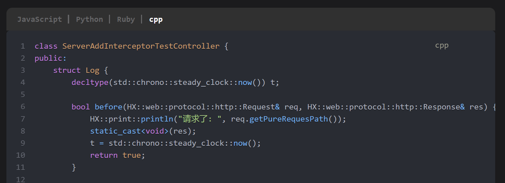
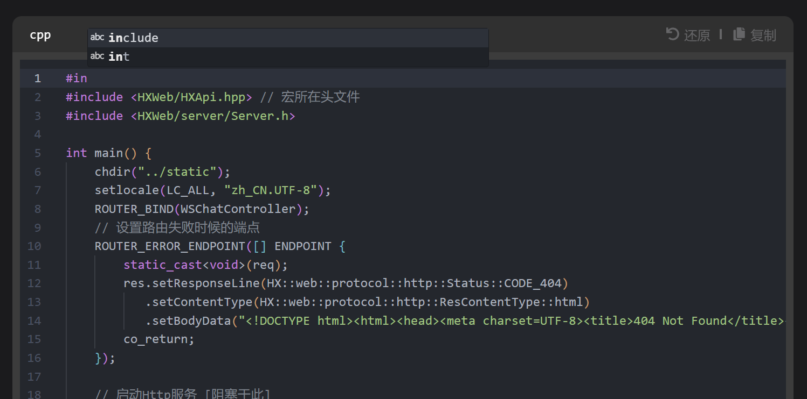

<h1 align="center">HXLoLiHub</h1>

## 一、简介

HXLoLiHub是一款基于 [Docusaurus](https://docusaurus.io/) 魔改的主题.

- 它的代码块使用的是`One-Dark-Pro`主题.

- 支持了嵌入`BiLiBiLi`视频、力扣同款分组代码块、Monaco Editor编辑器、`.drawio.svg`文件预览等等.

> 具体效果, 可以前往 [Githu Page - HXLoLiHub](https://hengxin666.github.io/HXLoLiHub/) 查看.

### 1.1 👋 核心理念

核心理念是非侵入式编写 MarkDown 文本, 比如:

- 力扣同款分组代码块是基于```代码块语法的, 即便你日后迁移到其他平台, 它只是退化为普通的代码块, 而 **不是** 一些无法被支持的`Html`/`MDX`语法.

- `.drawio.svg`文件预览是基于``图片块语法的, 即便你日后迁移到其他平台, 它只是退回为普通的图片; 并且文件还是使用`.svg`, 其在几乎任何平台都是支持的图片格式, 无需因为丢失`.drawio.svg`而烦恼(至少`Draw.io`还是可以编辑它们的).

### 1.2 ✨ 特性

- 🦖 **基于 Docusaurus** - 强大的文档生成和博客功能，帮助您轻松搭建和管理内容。
- ✍️ **Markdown 支持** - 使用简洁易读的 Markdown 格式进行创作，让写作变得更加轻松和高效。
- 🎨 **美观设计** - 以用户体验为核心，提供整洁、现代的界面，确保优雅的阅读体验。
- 🌐 **国际化支持 (i18n)** - 内建国际化功能，轻松支持多语言切换，让您的内容覆盖全球。
- 🚀 **持续集成与自动部署** - 集成 CI/CD 流程，实现自动化更新和部署，让您的文档随时保持最新。
- 🖥️ **轻松部署到 Github Pages** - 无需额外的服务器，直接将项目部署到 Github Pages，简单高效。
- 🌈 **高度自定义** - 在此基础上，您可以自由“魔改”系统，灵活定制和扩展以满足您的独特需求。

## 二、核心功能预览

- 支持力扣同款分组代码块:



- 支持在浏览器上编辑代码(纯前端, 不会修改到本地数据, 仅相当于暂时编辑区), 以代替复制:



- 支持在浏览器上预览`.drawio.svg`文件:


> 更多功能, 请见 [MarkDown 拓展](https://hengxin666.github.io/HXLoLiHub/docs/HXLoLiHub%E4%BD%BF%E7%94%A8%E8%AF%B4%E6%98%8E/MarkDown%E6%8B%93%E5%B1%95)

## 三、使用与部署
### 3.1 使用
```shell
git clone https://github.com/HengXin666/HXLoLiHub.git
cd HXLoLiHub
npm i
npm run start
```

此时即可在本地打开 http://127.0.0.1:3000/ 预览到项目.

### 3.2 部署

项目已经配置了 `Github 工作流` 您只需要推送则会自动进行部署到 `Github Page`.

> [!TIP]
> 当然, 在此之前还需要一些配置 (待更新)

或者在本地手动运行:

```shell
npm docusaurus deploy
```

也会编译然后部署到 `Github Page`上.

## 四、相关依赖
### 4.1 依赖组件

| 功能 | 描述 | 依赖 |
|:-:|:-:|:-:|
| **Docusaurus** | 利用React的静态网站生成器 | [Docusaurus-v3.7](https://github.com/facebook/docusaurus/releases/tag/v3.7.0) |
| **可编辑代码块** | 集成 Monaco Editor, 使得代码块可编辑 | [Monaco Editor (0.52.2)](https://github.com/Microsoft/monaco-editor) <br /> [react-monaco-editor (0.58.0)](https://github.com/react-monaco-editor/react-monaco-editor) <br /> [@monaco-editor/react (4.7.0)](https://github.com/suren-atoyan/monaco-react) |
| **OneDark-Pro 主题** | 为代码块集成 OneDark-Pro 主题 | [OneDark-Pro](https://github.com/Binaryify/OneDark-Pro) |
| **Draw.io 预览**| React 编写的 Draw.io 网页端支持 | [react-drawio](https://github.com/marcveens/react-drawio) |
| **Remark Github Alert 插件** | GitHub 风格的 remark 警报 | [remark-github-alerts](https://github.com/hyoban/remark-github-alerts) |
| **数学渲染 KaTeX** | 使用 KaTeX 渲染数学公式 | [KaTeX](https://github.com/KaTeX/KaTeX)|
| **图片单击放大** | 图片点击放大功能 | [plugin-image-zoom](https://github.com/flexanalytics/plugin-image-zoom) |
| **文档关系图** | 生成 Docusaurus 文档之间的关系图 | [docusaurus-graph](https://github.com/Arsero/docusaurus-graph) |
| **评论功能** | 基于 Giscus 添加评论功能 | [@giscus/react](https://github.com/giscus/giscus-component) |
| **文件夹和 markdown 图标** | 使用 vscode-icons 提供的文件夹和 markdown 图标 <br /> (仅使用了`文件夹`和`markdown`图标) | [vscode-icons](https://github.com/vscode-icons/vscode-icons) |

> 以上内容, 排名不分先后. 还有很多依赖, 没有列出来, 感谢所有的开源项目及项目维护者!

### 4.2 环境依赖

| 依赖环境 | 版本 | 备注 |
|:-:|:-:|:-:|
| **Docusaurus** | 3.7 | [Docusaurus](https://github.com/facebook/docusaurus/) |
| **NodeJs** | 18 | [nodejs](https://nodejs.org/zh-cn/) |
| **npm** | 10.7.0 (本地环境) | [npm](https://www.npmjs.com/) |
| **React** | ^19.1.0 | [React](https://react.dev/) |
| **TypeScript** | ~5.6.2 | [TypeScript](https://www.typescriptlang.org/) |

### 4.3 内容参考

> 排名不分先后.

- [手把手教你实现在Monaco Editor中使用VSCode主题](https://www.cnblogs.com/wanglinmantan/p/15345204.html) (待学习)

- [用 Giscus 给 Docusaurus 博客增加评论区](https://zhuanlan.zhihu.com/p/717218474)、[Docusaurus 添加评论功能](https://www.alanwang.site/posts/blog-guides/docusaurus-comment)

- [代码块(CodeBlock)显示语言名称](https://jdocs.wiki/docusaurus-site/site-creation-guide/code-block-show-language-name)

- [添加Remark Github Alert插件](https://jdocs.wiki/docusaurus-site/plugins/plugins-remarkjs-github-alerts)

- [部分主题魔改的样式、代码参考: kuizuo/blog](https://github.com/kuizuo/blog)

- Chat-GPT 贡献了项目 80% 的 Bug, 大部分内容只能查文档或者在Github上学习别人写的源码应用.

## 五、联系我们

如果您有任何问题或建议, 欢迎通过 [Issues](./issues) 反馈.

## 六、许可证

[Apache-2.0](./LICENSE)