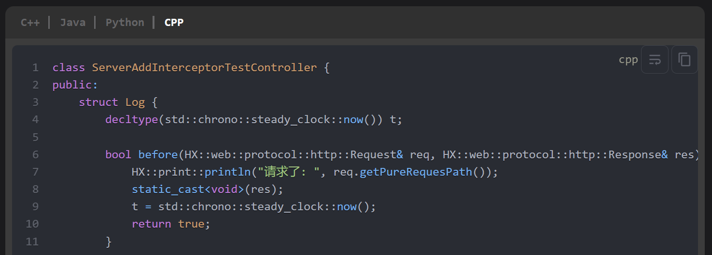
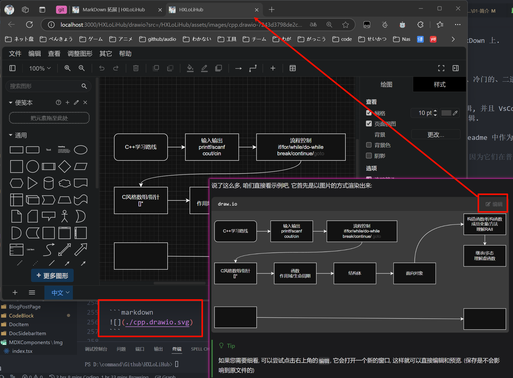

<h1 align="center">HXLoLiHub</h1>

## 一、简介

HXLoLiHub是一款基于 [Docusaurus](https://docusaurus.io/) 魔改的主题.

- 它的代码块使用的是`One-Dark-Pro`主题.

- 支持了嵌入`BiLiBiLi`视频、力扣同款分组代码块、Monaco Editor编辑器、`.drawio.svg`文件预览等等.

> 具体效果, 可以前往 [Githu Page - HXLoLiHub](https://hengxin666.github.io/HXLoLiHub/) 查看.

### 1.1 👋 核心理念

核心理念是非侵入式编写 MarkDown 文本, 比如:

- 力扣同款分组代码块是基于```代码块语法的, 即便你日后迁移到其他平台, 它只是退化为普通的代码块, 而 **不是** 一些无法被支持的`Html`/`MDX`语法.

- `.drawio.svg`文件预览是基于``图片块语法的, 即便你日后迁移到其他平台, 它只是退回为普通的图片; 并且文件还是使用`.svg`, 其在几乎任何平台都是支持的图片格式, 无需因为丢失`.drawio.svg`而烦恼(至少`Draw.io`还是可以编辑它们的).

### 1.2 ✨ 特性

- 🦖 **基于 Docusaurus** - 强大的文档生成和博客功能，帮助您轻松搭建和管理内容。
- ✍️ **Markdown 支持** - 使用简洁易读的 Markdown 格式进行创作，让写作变得更加轻松和高效。
- 🎨 **美观设计** - 以用户体验为核心，提供整洁、现代的界面，确保优雅的阅读体验。
- 🌐 **国际化支持 (i18n)** - 内建国际化功能，轻松支持多语言切换，让您的内容覆盖全球。
- 🚀 **持续集成与自动部署** - 集成 CI/CD 流程，实现自动化更新和部署，让您的文档随时保持最新。
- 🖥️ **轻松部署到 Github Pages** - 无需额外的服务器，直接将项目部署到 Github Pages，简单高效。
- 🌈 **高度自定义** - 在此基础上，您可以自由“魔改”系统，灵活定制和扩展以满足您的独特需求。

## 二、核心功能预览

- 支持力扣同款分组代码块:



- 支持在浏览器上编辑代码(纯前端, 不会修改到本地数据, 仅相当于暂时编辑区), 以代替复制:


- 支持在浏览器上预览`.drawio.svg`文件:



> 更多功能, 请见 [MarkDown 拓展](https://hengxin666.github.io/HXLoLiHub/docs/HXLoLiHub%E4%BD%BF%E7%94%A8%E8%AF%B4%E6%98%8E/MarkDown%E6%8B%93%E5%B1%95)

## 三、使用与部署
### 3.1 使用
```shell
git clone https://github.com/HengXin666/HXLoLiHub.git
cd HXLoLiHub
npm i
npm run start
```

此时即可在本地打开 http://127.0.0.1:3000/ 预览到项目.

### 3.2 部署

项目已经配置了 `Github 工作流` 您只需要推送则会自动进行部署到 `Github Page`.

> [!TIP]
> 当然, 在此之前还需要一些配置 (待更新)

或者在本地手动运行:

```shell
npm docusaurus deploy
```

也会编译然后部署到 `Github Page`上.

## 四、相关依赖

> 未完成, @todo Heng_Xin, 原因: 编写格式不对

- [代码块(CodeBlock)显示语言名称](https://jdocs.wiki/docusaurus-site/site-creation-guide/code-block-show-language-name)
    - 并且基于此, 二次开发, 添加了 [monaco-editor](https://github.com/microsoft/monaco-editor), 让一些代码块可编辑.
    - 并且添加了 [OneDark-Pro](https://github.com/Binaryify/OneDark-Pro) 主题
    - 特别的, 该组件为客户端渲染!
    - @todo: 应该学习[主题升级](https://www.cnblogs.com/wanglinmantan/p/15345204.html), 使其更加贴切vscode! (好难, 没时间, 暂时不搞了)

- [添加Remark Github Alert插件](https://jdocs.wiki/docusaurus-site/plugins/plugins-remarkjs-github-alerts)
    - 基于[remark-github-alerts](https://github.com/hyoban/remark-github-alerts)

- [数学渲染 KaTeX](https://docusaurus.nodejs.cn/docs/markdown-features/math-equations)
    - 原项目与依赖样式: [KaTeX](https://github.com/KaTeX/KaTeX)

- [图片单击放大](https://github.com/flexanalytics/plugin-image-zoom)

- [文档关系图](https://github.com/Arsero/docusaurus-graph)

- [支持评论: 基于giscus](https://giscus.app/zh-CN) 依赖 [@giscus/react](https://www.npmjs.com/package/@giscus/react), 感谢 [用 Giscus 给 Docusaurus 博客增加评论区](https://zhuanlan.zhihu.com/p/717218474)、[Docusaurus 添加评论功能](https://www.alanwang.site/posts/blog-guides/docusaurus-comment) 的文章教学!

- 使用了[vscode-icons](https://github.com/vscode-icons/vscode-icons)的`文件夹`和`markdown`图标

> [!TIP]
> giscus 本系统是基于`url`映射的, 请注意, 一旦定下文件名, 就不能调整了 (虽然title也是这样的...)