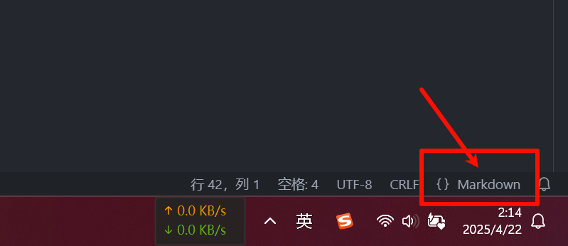
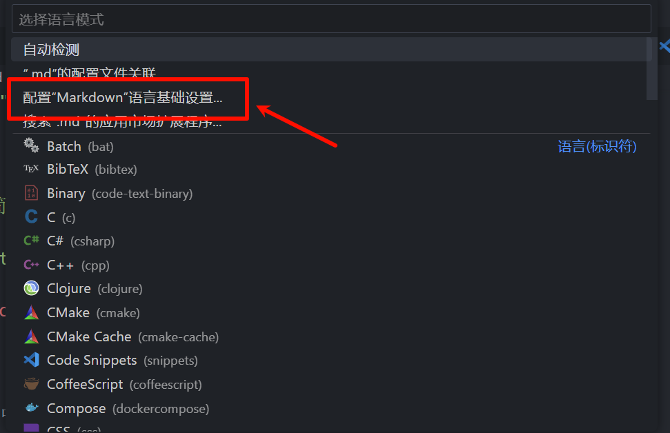

这是一篇模版文章, 教您如何编写博客, 以及提供了`VsCode`的代码片段, 以快速编写博客!

<!-- truncate -->

## VsCode 代码片段 模版

设置 -> 代码片段 -> markdown -> 填写以下内容: (您需要修改一下`authors`为你自己的名称)

```json vscode
"HXLoliHubBlog模版": {
    "prefix": "mdBlogBegin",
    "body": [
        "---",
        "authors: Heng_Xin",
        "title: ${1:标题}",
        "date: ${CURRENT_YEAR}-${CURRENT_MONTH}-${CURRENT_DATE} ${CURRENT_HOUR}:${CURRENT_MINUTE}:${CURRENT_SECOND}",
        "tags:",
        "    - ${2:标签}",
        "---",
        "",
        "${3:简介}",
        "",
        "<!-- truncate -->",
    ],
    "description": "HXLoliHub Blog模版"
}
```

然后尝试在`.md`中打`mdBlogBegin`, 理论上就会出现这个模版.

如果连代码提示都没有, 那么可以尝试:

点击:



然后会出现:



然后就会跳转到配置文件:

```json vscode
"[markdown]": {
    // 粘贴下面内容
    "editor.wordWrap": "on",
    "editor.quickSuggestions": {
        "other": "on",
        "comments": "off",
        "strings": "on"
    },
    // 下面这个是一个插件, 你可以去下载一下, 很方便的, 直接在 vscode 拓展中搜索: Markdown All in One 即可
    "editor.defaultFormatter": "yzhang.markdown-all-in-one"
},
```

然后回答`.md`文件, 应该就有代码提示了~