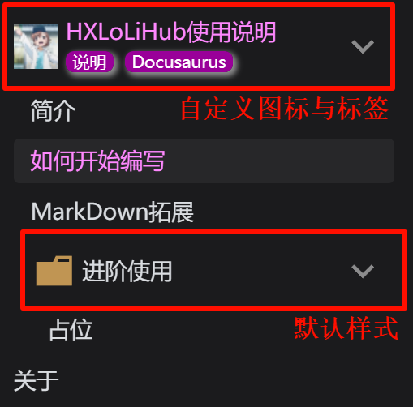

# 如何开始编写
## 零、先决条件
### 0.1 项目目录结构

```shell
.
├── blog                           # 博客
│   └── first-blog.md
├── docs                           # 文档/笔记
│   └── doc.md
├── src
│   ├── components                 # 组件
│   ├── css                        # 自定义CSS
│   ├── pages                      # 自定义页面
│   ├── theme                      # 自定义主题组件
│   └── utils
├── static                         # 静态资源文件
│   ├── default-icons              # 自带的图标 (不要删除, 仅系统使用)
│   ├── default-img                # 自带的图片 (不要删除, 仅系统使用)
│   ├── icons                      # 静态图标 (用户可自定义)
│   └── img                        # 静态图片 (用户可自定义)
│
├── scripts                        # 脚本
│   └── generateSidebar.js         # 自动化生成侧边栏配置 (会读取`tag.json`以生成带图标、标签的侧边栏)
│
├── docusaurus.config.ts           # 站点的配置信息
├── sidebars.ts                    # 文档的侧边栏 (应使用 generateSidebar.js 进行生成)
├── package.json
├── tsconfig.json
└── push.bat                       # 一键生成侧边栏并且提交然后上传到远程仓库 (格式: .\push.bat "提交信息")
```

### 0.2 使用前须知

1. 您需要配置 **评论服务**, 找到 `docusaurus.config.ts` 文件, 修改:

```ts vscode
themeConfig: {
    // 评论设置
    giscus: {
      // 此处获取配置: https://giscus.app/zh-CN , 具体需要如何配置, 链接里面有描述
      repo: '您的仓库',
      repoId: '通过上面网址生成',
      category: 'General',
      categoryId: '通过上面网址生成',
      // 颜色主题
      theme: 'light_high_contrast',
      darkTheme: 'dark_tritanopia'
    },
}
```

以及一些其他的配置, 可以参照 `docusaurus.config.ts` 文件的注释和`Docusaurus`官方文档自行修改!

> [!WARNING]
> 如果不配置, 或者不使用, 也请删除这个配置. 不然它将使用我的评论服务...

2. `BaseUrl` 的修改

找到 `docusaurus.config.ts` 文件, 修改:

```ts vscode
// 基础路径, 末尾不带 '/'
const BaseUrl = "/HXLoLiHub";
```

将其修改为您的路径.

比如`https://www.hxloli.com/hx`, 作为项目的根路径, 那么请配置为`const BaseUrl = "/hx";`

## 一、笔记

> [!TIP]
> 笔记位于 `./docs/**` 中.

### 1.1 命名规范

原生的 Docusaurus 支持以 `01-xxx` 为命名, 其保证了本地浏览可以按照文件名排序, 而渲染到网页上时候, 会自动去掉 `01-` 前缀.

因此, 无论是文件夹还是文件, 我都推荐以`数字-`作为前缀, 以利用默认的排序!

示例:

```shell
./docs
└── 01-HXLoLiHub使用说明
    ├── 01-简介
    │   ├── index.md
    │   └── xxx.png         # 您可以放置一些文件, 以相对引用
    ├── 02-如何开始编写
    │   └── index.md
    └── 03-MarkDown拓展
        └── index.md
```

命令行输入 `node .\scripts\generateSidebar.js`, 其侧边栏会被渲染为:

```shell
HXLoLiHub使用说明
|- 简介
|- 如何开始编写
|- MarkDown拓展
```

> [!TIP]
> 您需要知道的是, 如果是 `文件夹 > index.md`, 那么渲染出来的侧边栏, 就不会有文件夹, 而是一个文件, 其内容是 `index.md` 的内容.
>
> 为什么呢?
>
> 因为这样方便我们直接在 `文件夹` 内存放我们需要引用的图片等资源, 方便管理.
>
> 但如果是 `文件夹 > xxx.md`, 其中 `xxx != index`, 则不会有这种效果.

### 1.2 渲染文件夹图标与标签



如上图, HXLoLiHub自定义了侧边栏组件, 使其可以渲染图标和标签.

您可以在需要自定义图标或者标签的 **文件夹** 的 **子目录** 下, 创建一个 `tag.josn`, 然后编写以下内容:

```json vscode
{
    "icon": "misaka.png",
    "tags": ["说明", "Docusaurus"]
}
```

其中

- `icon` 是图标路径, 它 **必须** 放置在 `./static/icon/**` 中.

    - 例如, `./static/icon/loli/misaka.png`, 您必需填写为 `loli/misaka.png`, 其他路径无效!

- `tags` 是图标路径, 是标签数组, 它会从左到右的渲染, 类型是一个 `json字符串数组`

> [!TIP]
> 以上参数无需全部填写, 如果不填则使用默认配置:
>
> - `icon` 为文件夹图标.
>
> - `tags` 为空, 仅渲染 文件夹图标 和 文件夹名称.

> [!WARNING]
> 以上内容 **必需** 通过 `node .\scripts\generateSidebar.js` 解析后, 才可以被渲染.
>
> > [!TIP]
> > 您可以在命令行中输入 `.\push.bat`, **不** 填写提交信息, 那么只会执行一次 `node .\scripts\generateSidebar.js` 和 `git add .` 命令. 以简化命令编写.

## 二、博客

> [!TIP]
> 笔记位于 `./blog/**` 中.

### 2.1 命名规范

具体可以参考官方文档 [docusaurus#blog-post-date](https://docusaurus.io/zh-CN/docs/blog#blog-post-date)

博客没有任何特化的拓展, 它和原生的 Docusaurus 使用是一样的, 因此请查阅官方文档, 此处不概述了.

### 2.2 博客模版

如果您需要一个VsCode博客模版, 可以参考:

[VsCode博客模版](https://hengxin666.github.io/HXLoLiHub/blog/2025/4/22/02-vscode%E5%8D%9A%E5%AE%A2%E6%A8%A1%E7%89%88) (编写用户自定义代码片段)