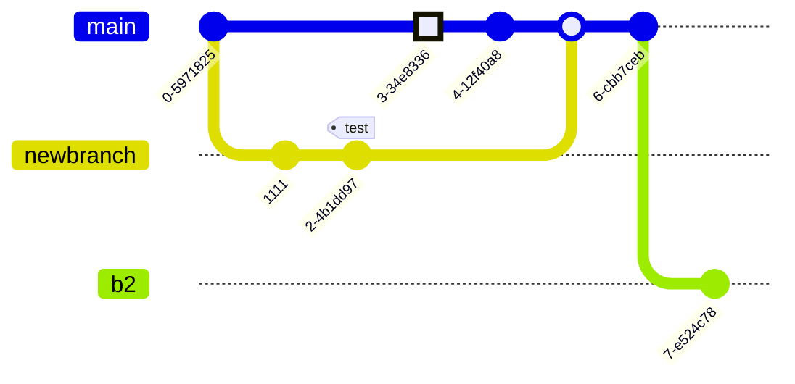

# MarkDown 拓展
## 一、图片拓展

Markdown 中的图片是无法控制宽高的, 通常图片的显示大小就是图片本身的大小.

因此我们拓展了它的语法, 使其可以控制:

- 图片宽度
- 图片圆角


```markdown

```

其具体的示例是:


```markdown

```

如果你想控制图片的宽度, 可以在图片名称后增加`##w200##`, 图片的宽度就为 200 像素.

同理, 控制图片圆角就可以使用`##r10##`.

> [!TIP]
> 宽度可以是百分比, 只需要在`w200`末尾增加百分号`%`即可(超过 100%无效), 如果不加百分号, 则默认单位为像素(px). (圆角同理)
>
> 本语法学习自 [Blossom 图片拓展](https://www.wangyunf.com/blossom-doc/guide/markdown.html#image) (**但不是完全兼容**)

## 二、组合代码块 (LeetCode同款)

对于普通的 MarkDown 代码块, 它只能在竖向排列多个:

```cpp
std::cout << "C++" << '\n';
```

```java
System.out.println("Java");
```

```python
print("Python")
```

这样子对于一些同样作用的内容, 在浏览的时候会变得麻烦, 你需要不停的滑动才可以查看到内容. 并且更多的时候, 你还需要提供文本说明. 可明明是一类东西, 这样会显然内容很臃肿.

因此, 我实现了力扣同款组合代码块, 使其在样式上和 MarkDown 语法上都和力扣语法无异:

```cpp [g1-C++]
std::cout << "C++" << '\n';
```

```java [g1-Java]
System.out.println("Java");
```

```python [g1-Python]
print("Python")
```

```cpp [g1-One-Dark-Pro主题展示]
class ServerAddInterceptorTestController {
public:
    struct Log {
        decltype(std::chrono::steady_clock::now()) t;

        bool before(HX::web::protocol::http::Request& req, HX::web::protocol::http::Response& res) {
            HX::print::println("请求了: ", req.getPureRequesPath());
            static_cast<void>(res);
            t = std::chrono::steady_clock::now();
            return true;
        }

        bool after(HX::web::protocol::http::Request& req, HX::web::protocol::http::Response& res) {
            auto t1 = std::chrono::steady_clock::now();
            auto dt = t1 - t;
            int64_t us = std::chrono::duration_cast<std::chrono::milliseconds>(dt).count();
            HX::print::println("已响应: ", req.getPureRequesPath(), "花费: ", us, " us");
            static_cast<void>(res);
            return true;
        }
    };

    ROUTER
        .on<GET, POST>("/", [](
            Request& req,
            Response& res
        ) -> Task<> {
            auto map = req.getParseQueryParameters();
            if (map.find("loli") == map.end()) {
                res.setResponseLine(Status::CODE_200)
                .setContentType(HX::web::protocol::http::ResContentType::html)
                .setBodyData("<h1>You is no good!</h1>");
                co_return;
            }
            res.setResponseLine(Status::CODE_200)
            .setContentType(HX::web::protocol::http::ResContentType::html)
            .setBodyData("<h1>yo si yo si!</h1>");
        }, Log{})
        .on<GET, POST>("/home/{id}/**", [](
            Request& req,
            Response& res
        ) -> Task<> {
            static_cast<void>(req);
            res.setResponseLine(Status::CODE_200)
            .setContentType(HX::web::protocol::http::ResContentType::html)
            .setBodyData("<h1>This is Home</h1>");
            co_return;
        })
    ROUTER_END;
};
```

语法:

````markdown
```cpp [g1-C++]
std::cout << "C++" << '\n';
```

```java [g1-Java]
System.out.println("Java");
```

```python [g1-Python]
print("Python")
```

# 通用语法:
> 只要它们使用相同的分组名, 就会被解析到同一个代码块, 无论是在文章的何处!

```语言 [分组名1-标题1]
// 代码块内容
```

```语言 [分组名1-标题2]
// 代码块内容
```
````

> [!WARNING]
> - 只要它们使用**相同的分组名**, 就会被解析到同一个代码块, **无论是在文章的何处**! *(只要是同一篇文章内)*
>
> - 标题名称 **不能** 相同! 否则是 UB (未定义行为)
>
> - 分组名称不能含有`-`, 例如 `[g-01-c++]` 你期望 `g-01` 是分组, 而实际上解析到的分组是 `g`. (因此尽量不要在分组代码块`[]`中使用`-`, 以免影响解析的正确性.)

## 三、可编辑的代码块 (内嵌VsCode同款编辑器)

对于一般的 MarkDown 文档, 它仅支持一键复制代码, 可很多我们需要复制的时候, 实际上都是一些记不得的命令:

例如, 以下命令, 它有很多参数, 而且参数大多是在中间的, 这如果直接复制粘贴到命令行上, 移动光标会比较麻烦.

```shell
# 随便编的命令
fk [本地路径] (目标URL) <目标对象名称> {目标对象邮箱} top-back
```

故此, 我思考: 如果可以提供一个临时编辑区, 这样会不会方便很多? 所以, 我直接内嵌一个`monaco-editor`编辑器, 其效果如下:

```shell vscode
# 随便编的命令
fk [本地路径] (目标URL) <目标对象名称> {目标对象邮箱} top-back
```

这样, 我们就可以对文本进行编辑, 并且 **不会** 对原内容产生影响! 并且本质是一个`VsCode`编辑器, 因此代码提示、代码折叠、搜索...等功能都具备. 并且贴心的准备了一键还原按钮, 您现在可以尝试对文本进行编辑操作, 自行体会一下~

其语法也很简单, 仅需要在语言后面添加一个`vscode`即可:

````markdown
```shell vscode
# 随便编的命令
fk [本地路径] (目标URL) <目标对象名称> {目标对象邮箱} top-back
```
````

> [!TIP]
> 我们支持 组合代码块 + VsCode 编辑器模式, 但是并不推荐这样使用:

```c++ [gvsc-CPP] vscode
int main() {
    return 0;
}
```

```py [gvsc-Python] vscode
print("Hello VsCode")
```

````markdown [gvsc-MD] vscode
```c++ [gvsc-CPP] vscode
int main() {
    return 0;
}
```

```py [gvsc-Python] vscode
print("Hello VsCode")
```
````

> [!NOTE]
> 它的语法是 `代码 [分组-标题] vscode` (具体, 请见上面组合代码块的`MD`页面)

## 四、Mermaid 图表渲染

非行内公式在代码块的基础上进行拓展, 在 **```** 后填写`mermaid`, 来指定代码块内容为 [Mermaid](https://mermaid.nodejs.cn/) 语法, 如下:

````markdown

````

则会被渲染为:


同时, 它也支持和组合代码块混合使用:





## 五、可在线编辑的 `.drawio.svg`

我个人有一个需求, 就是在 MarkDown 上做思维导图, 而市面上大部分的思维导图都是直接渲染为图片在 MarkDown 上.

这对于少量内容的思维导图还好, 但如果内容很多, 渲染出来的图片就会糊得不行, 即便放大也看不清.

而且, 大多数思维导图都有自己规定的格式, 如 自定义的`json`、`xml`文件解析后, 才渲染; 亦或是闭源的、冷门的、二进制的文件. 这些都不方便保存或者迁移.

因此我现在使用 [Drawio](https://www.drawio.com/), 它提供了一种前端编辑器, 让我们轻松的预览与编辑, 并且 VsCode 有对应的 [插件](https://marketplace.visualstudio.com/items?itemName=hediet.vscode-drawio), 可以轻松的编辑.

并且, 它支持对`.drawio.svg`进行编辑, 编辑后的内容就和普通的`.svg`一样, 并且还可以在 Github 的 Readme 中作为图片被渲染出来.

> 也就是说, 它本身就是图片; 因此 即便您日后打算数据迁移, 也不会因为无法迁移`drawio`的数据而烦恼, 因为它们在普通的 MarkDown 渲染上, 只是被当做图片.

> [!TIP]
> Drawio 不仅支持`.drawio.svg`还支持`.drawio.png`与`.drawio`等文件格式, 可本库仅对`.svg`版本进行特化. 也就是 **不支持** 其他的 Drawio 文件格式!

说了这么多, 咱们直接看示例吧, 它首先是以图片的方式渲染出来:


> [!TIP]
> 如果您需要细看, 可以尝试点击右上角的`编辑`, 它会打开一个新的窗口, 这样就可以直接编辑和预览. (保存是不会影响到原文件的)

其语法也很简单, 和普通的图片语法没有区别, 只要它是`.svg`结尾的, 都会被渲染为"可编辑的":

```markdown

```

> [!WARNING]
> 语法日后可能会修改, 因为不是所有的`.svg`都是 Drawio 文件, 理论上日后应该是在配置文件中配置开关, 选择是默认以`.svg`渲染, 还是需要`##drawio##` 才渲染.

## 六、Katex 数学公式

数学公式依赖于 [Katex](https://github.com/KaTeX/KaTeX)

### 6.1 行内公式

行内公式在单行代码块的基础上进行拓展, 你需要在 `$$` 内部书写 $KaTeX$ 语法, 如下:

这是一个行内公式: $f(x) = \int_{-\infty}^\infty  \hat f(x)\xi\,e^{2 \pi i \xi x}  \,\mathrm{d}\xi$

它写做:

```markdown
这是一个行内公式: $f(x) = \int_{-\infty}^\infty  \hat f(x)\xi\,e^{2 \pi i \xi x}  \,\mathrm{d}\xi$
```

### 6.2 非行内公式
非行内公式除了支持官方的 `$$` 语法外, 还支持在代码块```后填写 katex, 来指定代码块内容为 $KaTeX$ 语法, 如下:

$$
\left\{ \begin{array}{l}
0 = c_x-a_{x0}-d_{x0}\dfrac{(c_x-a_{x0})\cdot d_{x0}}{\|d_{x0}\|^2} + c_x-a_{x1}-d_{x1}\dfrac{(c_x-a_{x1})\cdot d_{x1}}{\|d_{x1}\|^2} \\[2ex]
0 = c_y-a_{y0}-d_{y0}\dfrac{(c_y-a_{y0})\cdot d_{y0}}{\|d_{y0}\|^2} + c_y-a_{y1}-d_{y1}\dfrac{(c_y-a_{y1})\cdot d_{y1}}{\|d_{y1}\|^2} \end{array} \right.
$$

语法:

````markdown
$$
\left\{ \begin{array}{l}
0 = c_x-a_{x0}-d_{x0}\dfrac{(c_x-a_{x0})\cdot d_{x0}}{\|d_{x0}\|^2} + c_x-a_{x1}-d_{x1}\dfrac{(c_x-a_{x1})\cdot d_{x1}}{\|d_{x1}\|^2} \\[2ex]
0 = c_y-a_{y0}-d_{y0}\dfrac{(c_y-a_{y0})\cdot d_{y0}}{\|d_{y0}\|^2} + c_y-a_{y1}-d_{y1}\dfrac{(c_y-a_{y1})\cdot d_{y1}}{\|d_{y1}\|^2} \end{array} \right.
$$

# 某些编辑器中, 使用如下方式编辑公式
```katex
$$
\left\{ \begin{array}{l}
0 = c_x-a_{x0}-d_{x0}\dfrac{(c_x-a_{x0})\cdot d_{x0}}{\|d_{x0}\|^2} + c_x-a_{x1}-d_{x1}\dfrac{(c_x-a_{x1})\cdot d_{x1}}{\|d_{x1}\|^2} \\[2ex]
0 = c_y-a_{y0}-d_{y0}\dfrac{(c_y-a_{y0})\cdot d_{y0}}{\|d_{y0}\|^2} + c_y-a_{y1}-d_{y1}\dfrac{(c_y-a_{y1})\cdot d_{y1}}{\|d_{y1}\|^2} \end{array} \right.
```
````

- 同样的, 它也支持和组合代码块混合使用:

```latex [g3-不会的公式] 
\begin{array}{c} 
  H_{n}=\frac{n}{\sum \limits_{i=1}^{n}\frac{1}{x_{i}}}= \frac{n}{\frac{1}{x_{1}}+ \frac{1}{x_{2}}+ \cdots + \frac{1}{x_{n}}} \\ G_{n}=\sqrt[n]{\prod \limits_{i=1}^{n}x_{i}}= \sqrt[n]{x_{1}x_{2}\cdots x_{n}} \\ A_{n}=\frac{1}{n}\sum \limits_{i=1}^{n}x_{i}=\frac{x_{1}+ x_{2}+ \cdots + x_{n}}{n} \\ Q_{n}=\sqrt{\sum \limits_{i=1}^{n}x_{i}^{2}}= \sqrt{\frac{x_{1}^{2}+ x_{2}^{2}+ \cdots + x_{n}^{2}}{n}} \\ H_{n}\leq G_{n}\leq A_{n}\leq Q_{n} 
\end{array}
```

```katex [g3-不懂的公式]
\begin{array}{l}  
  \nabla \cdot \mathbf{E} =\cfrac{\rho}{\varepsilon _0}  \\  
  \nabla \cdot \mathbf{B} = 0 \\  
  \nabla \times  \mathbf{E} = -\cfrac{\partial \mathbf{B}}{\partial t }  \\  
  \nabla \times  \mathbf{B} = \mu _0\mathbf{J} + \mu _0\varepsilon_0 \cfrac{\partial \mathbf{E}}{\partial t }   
\end{array} 
```

> [!WARNING]
> 目前还未支持渲染化学公式等 $KaTeX$ 拓展内容.

## 七、多色引用块

目前仅支持 [Github 语法的语义化引用](https://github.com/orgs/community/discussions/16925) (基于 [remark-github-alerts](https://github.com/hyoban/remark-github-alerts) ).

> [!NOTE]
> 突出显示用户应考虑的信息，即使在浏览时也是如此。

> [!TIP]
> 帮助用户取得更大成功的可选信息。

> [!IMPORTANT]
> 用户成功所需的重要信息。

> [!WARNING]
> 由于存在潜在风险，需要用户立即关注的关键内容。

> [!CAUTION]
> 行为的潜在负面后果。

以下是其语法:

```markdown
> [!NOTE]  
> Highlights information that users should take into account, even when skimming.

> [!TIP]
> Optional information to help a user be more successful.

> [!IMPORTANT]  
> Crucial information necessary for users to succeed.

> [!WARNING]  
> Critical content demanding immediate user attention due to potential risks.

> [!CAUTION]
> Negative potential consequences of an action.
```

## 八、视频拓展

视频功能是在多行代码块的基础上拓展的, 目前支持的视频源如下:

1. [BiLiBiLi](https://www.bilibili.com/)

````markdown
<!-- 注意, 因为某些特性, 您需要在代码块内填写一些内容才可以解析到 -->
```bilibili ##BV1Js411o76u##w90%##h600##danmaku=false##p=2##
BV1Js411o76u (<-- 这里随便填写些内容即可)
```
````

**参数解析**:

- `bilibili`: 解析为 bilibili 视频, 必须为第一个参数(即原代码语言字段), 然后 **必须** 接`空格`.

- `avxxxxx`: 视频 avid, 视频id.

- `BVxxxxx`: 视频 bvid, 视频id. (注: `av`/`bv`字段二选一填写, 如果都填, 那么优先使用`bv`字段).

- *[可选]* `w90%`: 视频宽度为 90%, 如果宽度不以 `%` 结尾, 则会以像素计算. 如果未指定宽度, 则为 `75%`.

- *[可选]* `h600`: 视频宽度为高度为 600 像素, 高度 **不能** 为百分比. 如果未指定高度, 则为 400 像素.

- *[可选]* `danmaku=false`: 表示 **不开启** 弹幕, 其他值则是开启弹幕(默认).

- *[可选]* `p=2`: 表示视频分P, 即第几集, 不填写则默认 `p=1`.

其会被渲染为:

```bilibili ##BV1Js411o76u##w90%##h600##danmaku=false##p=2##
BV1Js411o76u
```

> [!TIP]
> 同理, 依旧支持组合代码块渲染:

```bilibili [g4-BV1Js411o76u] ##BV1Js411o76u##
BV1Js411o76u
```

```bilibili [g4-AV314] ##av314##w90%##h600##
av314
```