# 开始使用 (部署指南)

## 一、先决条件
### 1.1 知识准备
> [!TIP]
> 在开始使用之前, 您需要拥有一些知识, 否则接下来的内容你可能听不懂. 即便照着做了, 日后也很可能会出现一些自己无法解决的问题. (当然, 您可以尝试使用AI解决)

1. **有手段**. 可以上 Github 进行 git pull / push, 否则 Github Page 部分可能会出现问题.

2. 能够自主安装一些程序. 有独立自主的百度能力.

### 1.2 程序准备

- `git`: 需要使用`git`来`clone`和`push`仓库.

- `VsCode`: 一个编辑器, MarkDown 和 任何代码都可以使用它. (并且已经配置了对应的插件)

- `NodeJs`: >= 18.0 的版本.

- `NPM`: 前端的包管理工具.

## 二、本地运行
### 2.1 创建Github仓库

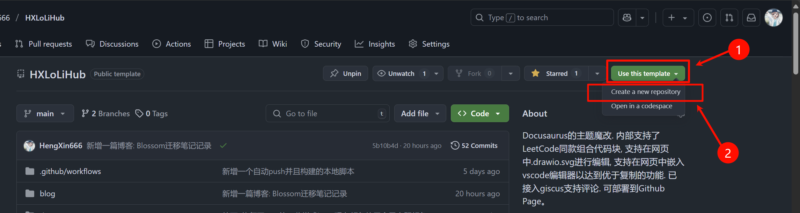

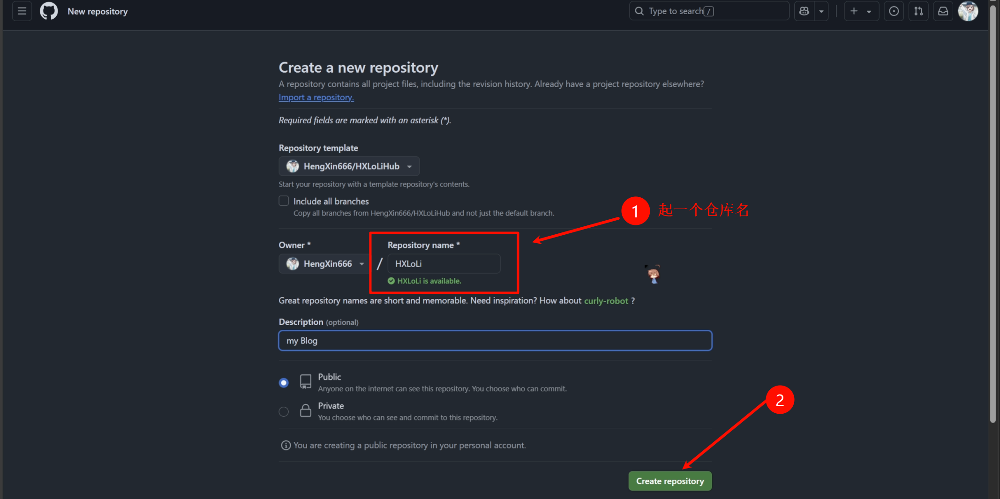

> [!TIP]
> 创建好后, 会默认运行一次 Github 工作流. 因为有些东西还没有配置, 所以必然是失败的.

### 2.2 克隆到本地进行一些配置

- 克隆仓库

```shell vscode
# 克隆仓库
git clone https://github.com/HengXin666/HXLoLiHub.git

# 进入仓库目录
cd HXLoLiHub

# 以此为根目录, 打开vscode
code .
```

- 安装环境

```shell
npm i
```

- 启动本地调试环境 (会默认打开浏览器并且展示网页)

```shell
npm run start
```

> [!NOTE]
> 如果上面都没有问题, 那么就是成啦!

- 自定义配置: 打开`docusaurus.config.ts`文件, 进行一些简单的配置

您看着改即可, 都有中文注释说明的. (对于 `url`、`baseUrl` 和 `评论服务`, 下文会提到)

## 三、部署到 Github Page
### 3.1 修改配置文件

打开`docusaurus.config.ts`文件, 找到:

```ts vscode
// 基础路径, 末尾不带 '/'
/* !!! 此处修改为您的项目名称  !!! */
const BaseUrl = "/HXLoLiHub";

// 站点配置
const config: Config = {
  title: "HXLoLiHub", // 项目名称
  tagline: "ここから先は一方通行だ!", // 项目的 tagline (副标题)
  favicon: "img/favicon.ico", // 项目图标, 可以根据实际情况更换

  // 站点的URL, GitHub Pages 一般需要设置为项目的路径
  /* !!! 此处修改为您的站点URL !!! */
  url: "https://HengXin666.github.io", // GitHub Pages 地址

  // ...
}
```

您至少需要修改两处: (已经使用`/* !!! ... !!! */`注释说明)

- `BaseUrl`: 设置为您Github项目的名称, 如 https://github.com/HengXin666/HXLoLi 是您的项目仓库, 那么 `HXLoLi` 就是您的项目名称.

- `url`: 配置您的`Github Page`站点URL, 一般为`https://用户名.github.io`, 依旧是上面的网址, 那么`HengXin666`就是您的用户名.

### 3.2 本地一键推送

使用下面的命令一键推送 (因为不同的机器的命令好像是不同的... 所以请你尝试一下那个目录可以用)

```shell vscode
# 下面的命令, 三选一, 只要能用就ok; 不能用, 就换一条...
npx docusaurus deploy

npm docusaurus deploy

docusaurus deploy
```

> [!TIP]
> 如果上面都没有问题, 那么等待执行完, 应该就会显示您之前配置的 `url`, 也就是`Github Page`站点URL.
>
> 此时, 打开您的Github仓库页面, 应该能看到:
>
> - 有对应`gh-pages`的部署分支
>
> 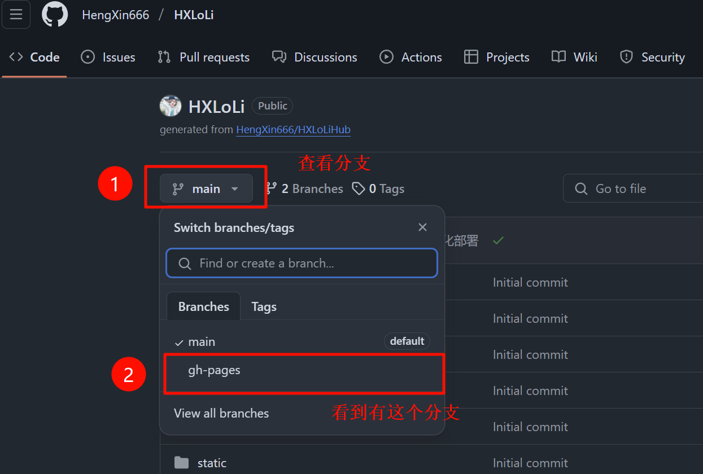
>
> - 在右侧语言栏上方, 有 Github Page 显示
>
> 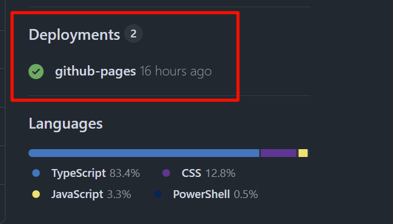
>
> 当然您直接打开 `Github Page`站点URL 也可以看到的...

> 但是如果不行, 但命令没有报错 (也就是已经推送`gh-pages`分支了, 那么可能是`BaseUrl`配置有问题, 你去上图那个地方点击进去看看, 会要求你修复的)

### 3.3 配置工作流, 仅推送主分支, 就自动部署

还记得我文章一开头说的 *(创建好后, 会默认运行一次 Github 工作流. 因为有些东西还没有配置, 所以必然是失败的.)* 吗?

现在我们就来修复一下它~

#### 3.3.1 配置部署密钥

- 来到您的Github仓库的设置处, 如下操作:

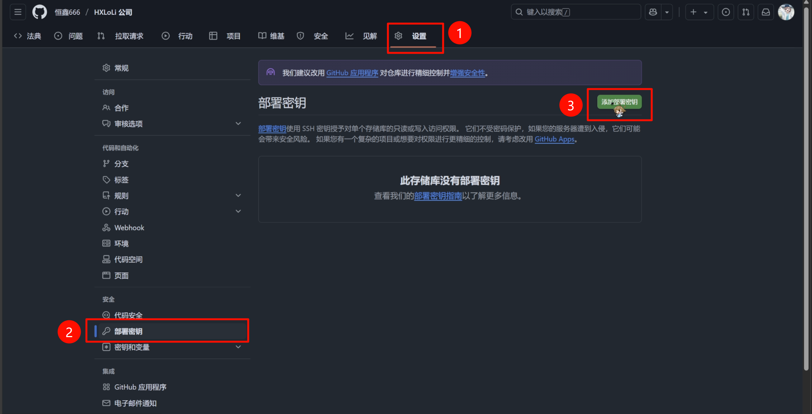

- 然后我们填写一下密钥:

1. 设置`标题`为: `GH_PAGES_DEPLOY`

2. **勾选** `允许写入`

3. 继续看下面的教程!!! (填写`项目名.pub` (公钥) 的内容)

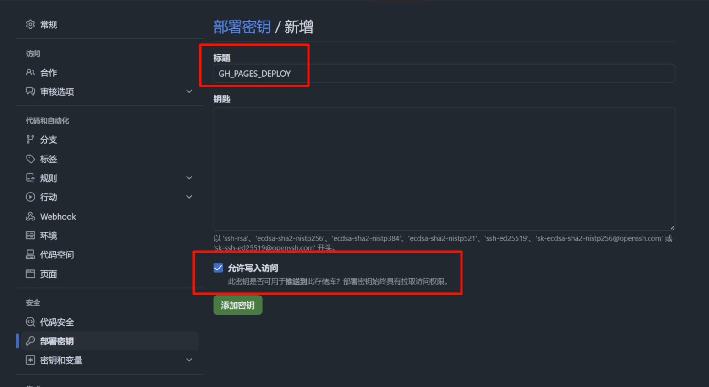

#### 3.3.2 生成密钥

打开`资源管理器`, 到 C盘 -> Users (也可能是`用户`文件夹) -> 您电脑的`用户名`的文件夹 -> `.ssh`文件夹

比如: `C:\Users\Heng_Xin\.ssh`

> [!TIP]
> 如果没有找到`.ssh`文件夹, 请打开显示隐藏文件夹的选项. (如果真没有, 就自己创建一个吧) (或者你知道你自己在做什么)

然后, 如下操作: (在路径栏输入`cmd`)

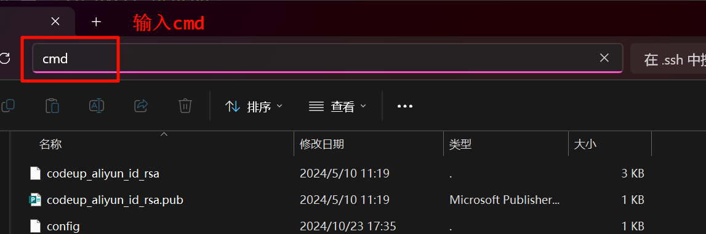

然后输入一下命令, 以生成密钥

```shell vscode
# 注意! 下面邮箱 需要填写你 Github 绑定的邮箱
ssh-keygen -t rsa -C "282000500@qq.com"
```

回车之后, 它首先会询问你保存的文件名, 文件名我建议你填写你的 `项目名称`, 以防止搞混.

然后一路回车, 完成后, 可以在 `.\ssh` (也就是当前目录) 看到生成的密钥 (两个文件):

- `项目名.pub` (公钥)

- `项目名` (私钥)

我们以 `记事本` 的方式打开 `项目名.pub` (公钥), 然后全选、复制; 粘贴到下面的 `钥匙` 处


然后 `3.3.1` 就完成了, 但是还妹有结束! 马上回去:

以 `记事本` 的方式打开 `项目名` (私钥), 然后全选、复制!

#### 3.3.3 配置仓库密钥

如下操作:

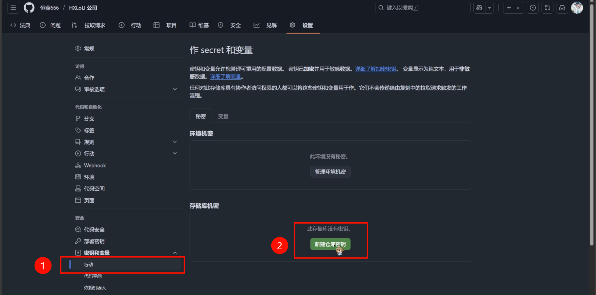

- 设置`姓名`为: `GH_PAGES_DEPLOY` (和之前的一样), 然后粘贴复制的私钥:

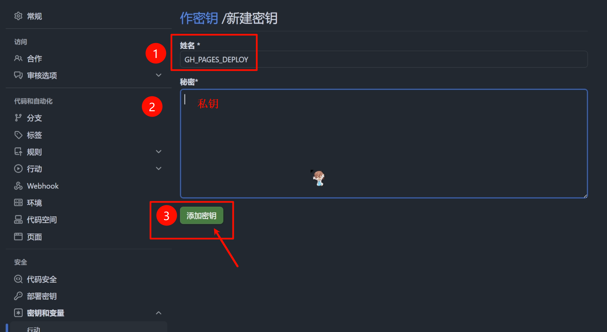

然后就大功告成啦!!!

### 3.4 测试推送

你随便修改点东西, 然后就把项目推送上去试试效果.

快捷推送:

运行 `.\push "提交信息"` 即可快速推送 (`.\psuh`实际上就是`.\push.ps1`这个脚本)

然后去你仓库看看, 工作流的运行状态:

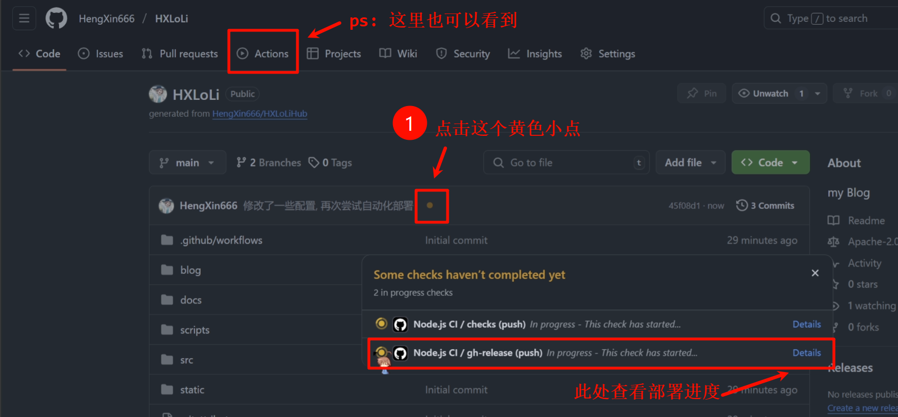

具体进度是这样显示的:

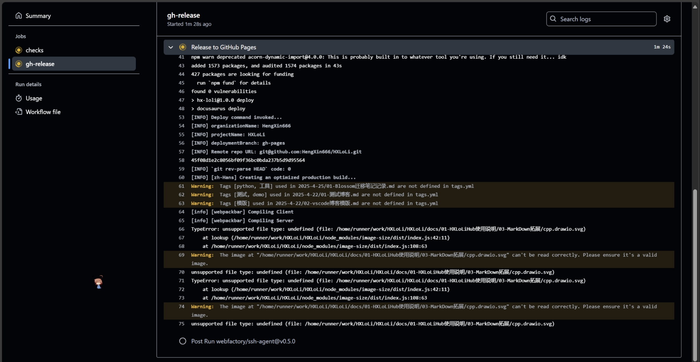

静静等待几分钟, 就可以去 Github Page 上面看看是否已经部署好啦~

> [!TIP]
> 由于缓存的原因, 如果你在部署完成的一瞬间, 去 Github Page 查看, 它可能 **不会** 是最新的样子
>
> 因为它使用了缓存! 你只需要多刷新两三次即可 (`CTRL + F5` 可以清除对当前页面的缓存) ~

至此, 您已经拥有一个自动部署的静态博客啦~~~

(当然, 我推荐您去配置一下 `评论服务`, 因为目前为止, 它似乎还是使用我的评论服务qwq...)