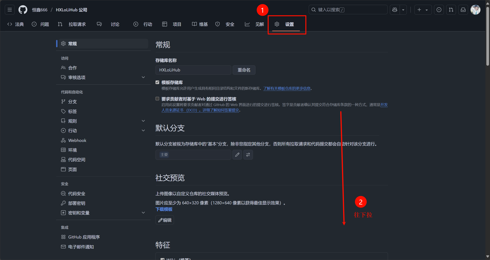
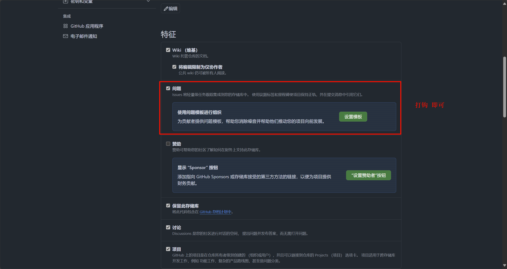
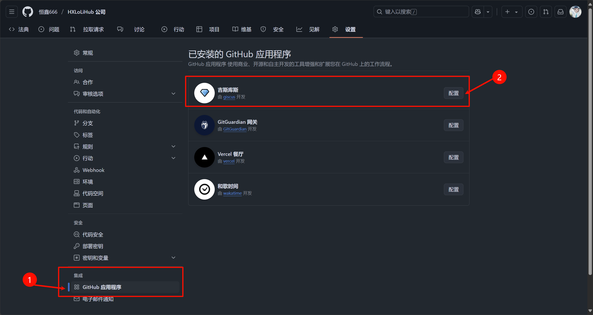
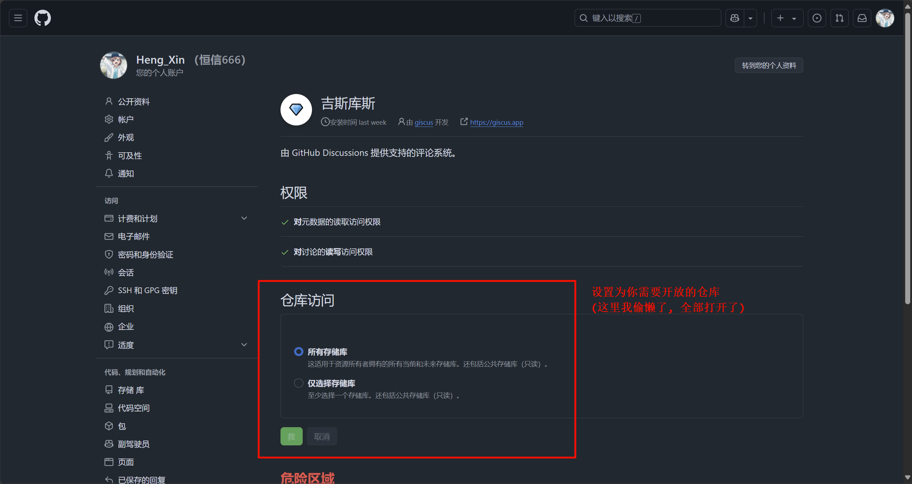
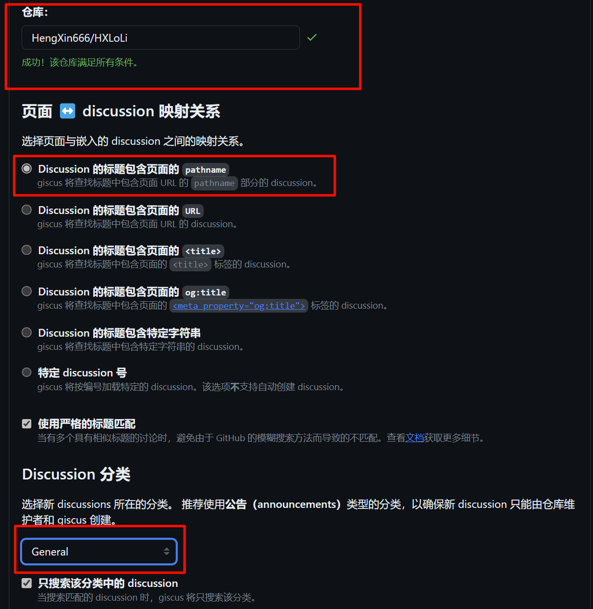
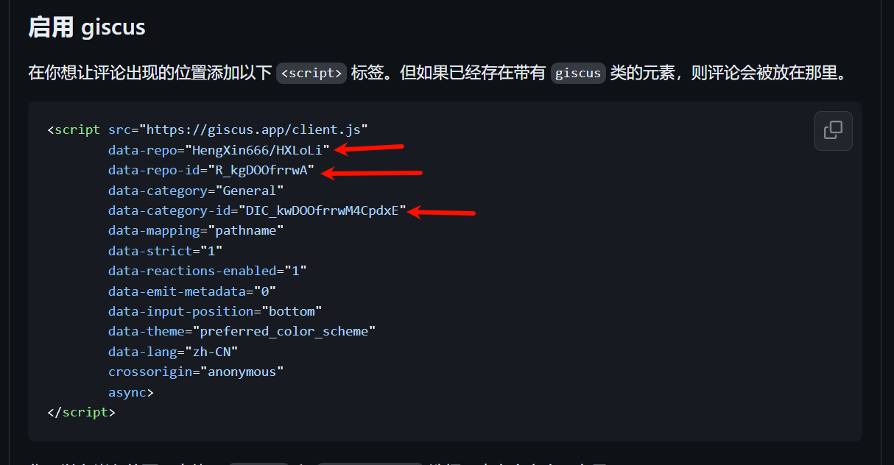
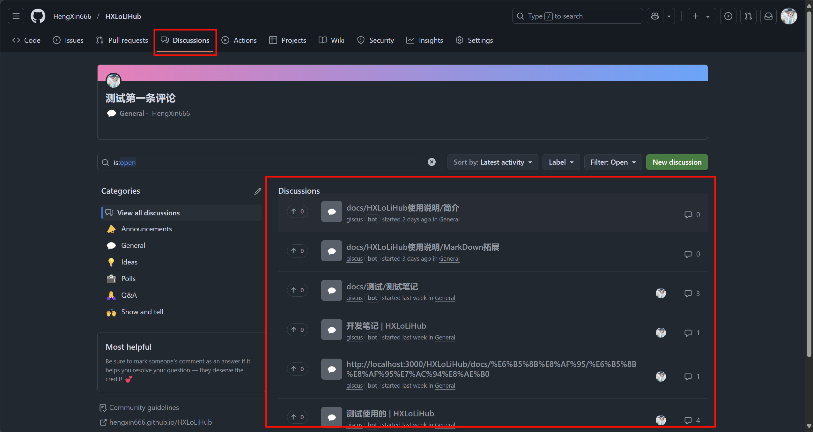

# 配置评论服务
## 零、先决条件

这个仓库是公开的! (当然你也可以新建一个仅用于讨论的仓库)

## 一、打开讨论区





## 二、配置 giscus





## 三、去获取 idKey

- 去这里: https://giscus.app/zh-CN

输入你的仓库, 如果是满足条件的, 就如下显示:



顺便和上面的选择一样.

然后就会生成下面这几个东西:



然后填写到 `docusaurus.config.ts` 的下面的位置:

```ts vscode
themeConfig: {
    // 评论设置
    giscus: {
      // 此处获取配置: https://giscus.app/zh-CN , 具体需要如何配置, 上文已经说明了
      repo: '您的仓库',
      repoId: '通过上面网址生成',
      category: 'General',
      categoryId: '通过上面网址生成',
      // 颜色主题
      theme: 'light_high_contrast',
      darkTheme: 'dark_tritanopia'
    },
}
```

然后现在你在你的博客评论, 就可以在你的项目的 `discussions` 处看到消息啦:

