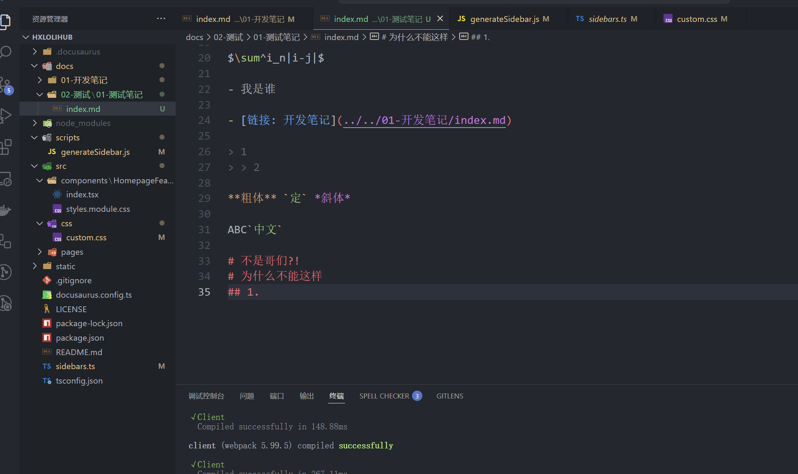

# 测试使用的

## 一、测试目录
### 1.1 测试子目录
#### 1.1.1 测试子子目录

## 二、测试目录
### 2.1 测试子目录
#### 2.1.1 测试子子目录
### 2.2 测试子目录
#### 2.2.1 测试子子目录
#### 2.2.2 测试子子目录

```javascript [group1-JavaScript] vscode
console.log('你好力扣')
```

```python [group1-Python]
print('你好力扣')
```

```ruby [group1-Ruby]
puts '你好力扣'
```

```cpp
int main() {
    return 0;
}
```

```C vscode
int main() {
    // 这个是交互式的!
}
```

```cpp VsCode
int main() {
    // 这个是交互式的!
    return 0;
}
```

```css VsCode
.languageName {
  font-size: 0.9rem;
  color: rgb(153, 153, 136);
  line-height: 34px;
  font-family: var(--ifm-font-family-monospace);
}
```

$\sum_{i=0}^{n-1} \sum_{j=0}^{i-1} |i + j|$

$$
\sum_{i=0}^{n-1} \sum_{j=0}^{i-1} |i + j|
$$

这是一个行内公式：$i$  
这是一个块级公式：

$$
\int_0^\infty e^{-x^2} dx = \frac{\sqrt{\pi}}{2}
$$

- 我是谁

- [链接: 开发笔记](../../01-开发笔记/index.md)

> 1
> > 2

**粗体** `定` *斜体*

ABC`中文`

# 不是哥们?!
# 为什么不能这样
## 1.




|图片|为什么|
|:-:|-:|
|表格|不是居中|

- [x] 根本不对

> [!NOTE]
> Useful information that users should know, even when skimming content.

> [!TIP]
> Helpful advice for doing things better or more easily.

> [!IMPORTANT]
> Key information users need to know to achieve their goal.

> [!WARNING]
> Urgent info that needs immediate user attention to avoid problems.

> [!CAUTION]
> Advises about risks or negative outcomes of certain actions.

组合代码块

```javascript {1}
console.log('你好力扣')
```
```python {1}
print('你好力扣')
```
```ruby {3} 
puts '你好力扣'
```